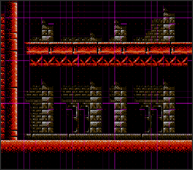
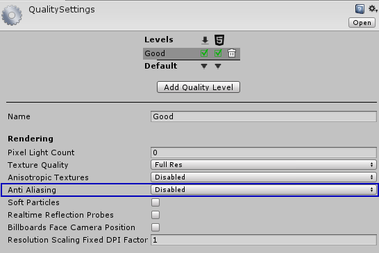
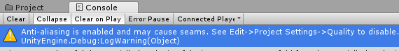
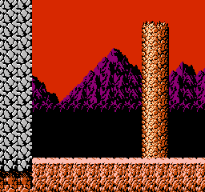
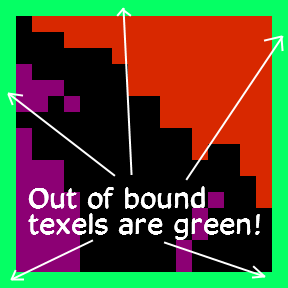
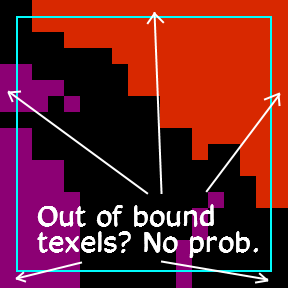
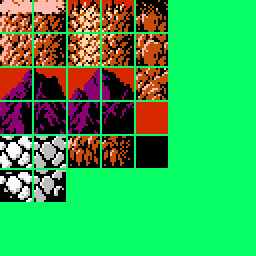
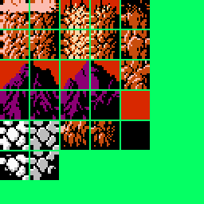
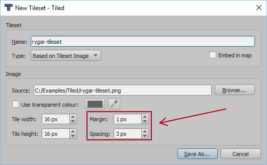

# Fixing Seams in Exported Tiled Maps

The most common complaint (and a valid one) with using Tiled2Unity is something along this, um, *line* ...

> After exporting my map I'm seeing these strange lines between some tiles. Am I doing something wrong?

Unfortunately, this a common problem with texture atlasing in 3D game engines. A tilesets is, by nature, a texture atlas
(i.e. an image containing a group of smaller images) and without special care you may end up with an exported map that looks something like this in the Unity editor ...



These lines are called **seams** and they are caused at the shader level.
(What is happening is that the texture sampler is choosing a texel that is just *barely* out of bounds due to mathemtical 
precision issues that is common in software development.)

# Disable Anti-Aliasing

The largest contributor to seams in your Unity project is anti-aliasing. This is enabled by default for Unity projects and is great for smoothing harsh edges in 3D applications.
However, we don't any of that for pixel-perfect 2D. Go into your Unity project's Quality Settings (`Edit -> Project Settings -> Quality`) and turn it off.



By the way, **Tiled2Unity** will warn you that you have anti-aliasing enabled during an export in Unity's Console window.



**Hint:** It is recommended that you always have the Unity's Console active and *always* strive to keep your project free of any warnings and errors.

# Pad Your Tiles - The Best Way to Get Rid of Seams Forever

Even with anti-aliasing disabled it is possible that under conditions that are *just so* that seams will still be visible.

In this example, we have a camera scrolling across a small scene using tiles from the NES version of Rygar ...



As you can see, we still have a problem with seams periodically. In this particular example, we have a 256x240 viewport and a camera with an orthographic size of 120
(a good rule of thumb is set your orthographic camera size to half your viewport height).

Now, we can fix even these seams by manipulating our camera position just right (in this case, never allowing half-unit values for position X and Y on the camera) but that
requires writing code that quantizes our camera position - and this becomes difficult to manage if we want to change our viewport size or zoom the camera in and out.

Instead, we use the same trick the pros do and add a border around our tiles. This way, if the texture sampler picks a (wrong) neighboring texel then at least it will a texel of the same color.

Below is one of our 16x16 pixel tiles from our original Rygar tileset next to the same tile with but with its edges extruded ...

 

With this approach we're no longer trying to fight the texture sampler. With matching pixels around every edge of our tile we simply don't care if the
renderer chooses the wrong neighboring texel in our tileset. This will solve seams **in all cases** no matter what your camera or viewport settings may be.


For reference, here are our Rygar tileset images.

 

Keep in mind that in Tiled you'll need to have your tileset settings reflect the spaces and margins between your tiles.



##Quick Hack: Tucking in Tile Texture Coordinates

In cases where you don't have time to manipulate your tilesets to make up for seams, Tiled2Unity does offer a feature that will allow you 'tuck in' your texture coofinates
to hopefully make up for any texture sampling errors: Simply add the `-t` or `--texel-bias` command when launching Tiled2Unity.

###Windows
```bat
"C:\Program Files\Tiled2Unity\Tiled2Unity.exe" %mapfile --texel-bias=8192
```

### Mac OS X
```bat
open -a /Applications/Tiled2UnityMac.app --args %mapfile --texel-bias=8192
```

If seams still appear then use a smaller power-of-two value for texel-bias (4096, 2048, 1024, etc.). You must use a value that is larger than your texture dimenions, however.


**Be Warned**: This should be thought of as a **temporary solution only**. It will lead to small, albeit less obvious, artifacts under some conditions.

