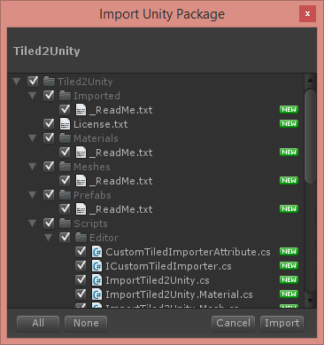
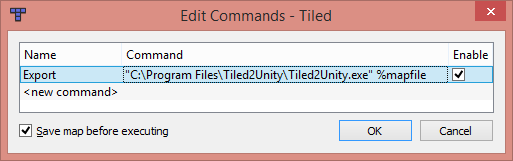

# Getting Started with Tiled2Unity

First, [download Tiled2Unity](http://www.seanba.com/tiled2unity) and install it on your computer.

* **Windows**: The MSI installer is recommended.
* **Mac**: Unzip the `Tiled2UnityMac[version].zip` file and drag the **Tiled2UnityMac.app** archive into your `Applications` folder.

Tiled2Unity requires a number of scripts and shaders to be installed on any Unity project you wish to export to. This is best achieved by running Tiled2Unity and selecting the `Help -> Import Unity Package to Project` menu item.


This will prompt you to import the Tiled2Unity package into your project.



**Remember:** Run this import step every time you update Tiled2Unity so that the latest scripts are in your Unity project.

## Running Tiled2Unity

Launching Tiled2Unity will show you this GUI ...


Everything you need to export a Tiled map to a Unity project should be explained there. You can also preview your map before exporting if you want to see how colliders will be created for you.

## Launching Tiled2Unity from Tiled

For convenience you can add a command to Tiled that will launch Tiled2Unity for you with the currently selected map.

Open the `Edit Commands...` dialog in Tiled ...


Here you can add a command to Tiled that will open Tiled2Unity, passing the current map as an argument. This command is platform specific.

### Windows

```bat
"C:\Program Files\Tiled2Unity\Tiled2Unity.exe" %mapfile
```


### Mac OS X

```bat
open -a /Applications/Tiled2UnityMac.app --args %mapfile
```


With this set you can make changes to your map in Tiled Map Editor, press `F5` and easily export to your Unity project.

