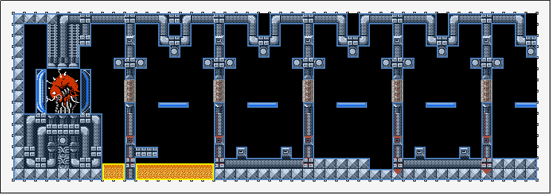

# Tiled2Unity Documentation

 By [Sean Barton](http://www.seanba.com)

**Tiled2Unity** is a free utlity that helps you export maps from the popular [Tiled Map Editor](http://www.mapeditor.org) to your Unity projects.

* **Windows** users will want the default **Tiled2Unity** utility
* For **Mac** users there a full-featured **Tiled2UnityMac** app
* For **Linux** users there is a **Tiled2UnityLite** command line utility which requires [Mono](http://www.mono-project.com/download) and [CS-Script](http://www.csscript.net) to run.

Tiled2Unity (and variants) are availble for download on my [game development blog](http://www.seanba.com/tiled2unity).

