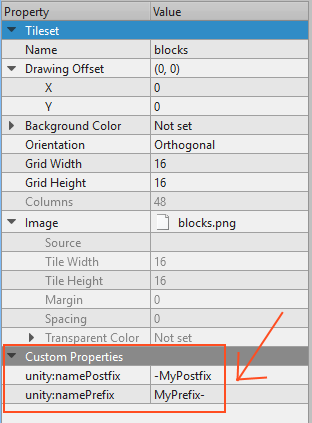

# Dealing with Texture Name Collisions

**Note:** This feature was added with Tiled2Unity 1.0.11.0

One common problem occurs when you have *different* textures that share the *same* filename. By default, Tiled2Unity will export those textures over each other leading to some visual bugs.

To fix this problem you can use one (or both) of the following custom properties on your tileset:

* `unity:namePrefix`
* `unity:namePostfix`

**As an example:** Say you have multiple tilesets that both reference different textures that share the same `blocks.png` filename. In Tiled edit the tileset with custom properties like so:

Now, when a map using this tileset is exported the texture will be exported as `MyPrefix-blocks-MyPostfix.png` instead of `blocks.png`. Similarly, the material asset created will be named `MyPrefix-blocks-MyPostfix.mat`.

**Note:** Normally you wouldn't use *both* a prefix and postfix. All that matters is that the resulting texture and material assets in your Unity project are uniquely named once importing is completed.
